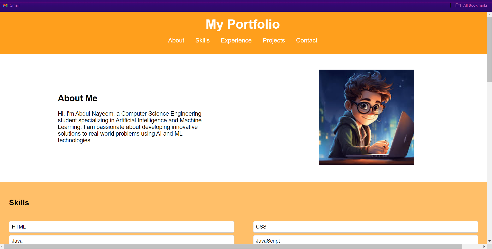
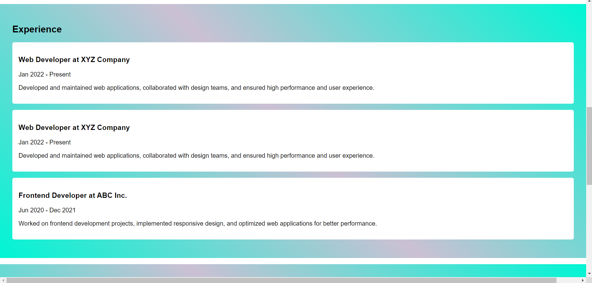
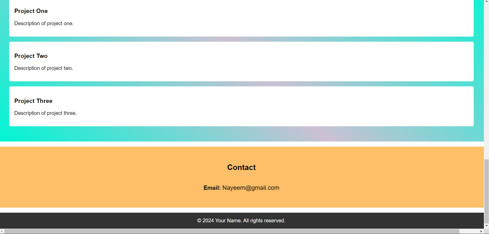

# Portfolio Website

## Introduction
As part of the CodSoft internship, I was tasked with creating a personal portfolio website. This project allowed me to apply my knowledge of HTML and CSS to build a functional and visually appealing website that highlights my skills and projects.

## Technologies Used
- **HTML:** Structure of the website
- **CSS:** Styling and layout of the website
- **Netlify:** Hosting the website

## Features
- Responsive design for different screen sizes
- Clean and modern layout
- Easy navigation between sections
- Downloadable resume in PDF format

## Sections
- **Header Section:** Contains my name/logo and a brief introduction or tagline.
- **About Section:** Includes an image of myself and a short bio highlighting my skills and experience.
- **Skills Section:** Lists my key skills or areas of expertise.
- **Projects Section:** Showcases samples of my work or projects with titles, descriptions, and images.
- **Resume Section:** Provides a link to download my resume in PDF format.
- **Contact Section:** Includes my contact information such as email address and phone number.
- **Footer:** Contains a copyright notice and any additional links or information.

## How to Use
To view the portfolio, visit the live website.

To run the project locally:
1. Clone the repository:
    ```bash
    git clone https://github.com/Nayeem-stud/codesoft-L1-T2-portfolio.git
    ```
2. Open `index.html` in your preferred web browser.

## Live Demo
Check out the live demo of the landing page [here](https://codesoftl1t2.netlify.app/).

## Contact
If you have any questions or suggestions, feel free to reach out to me at abdul3133@gmail.com.


**Image File**: 




